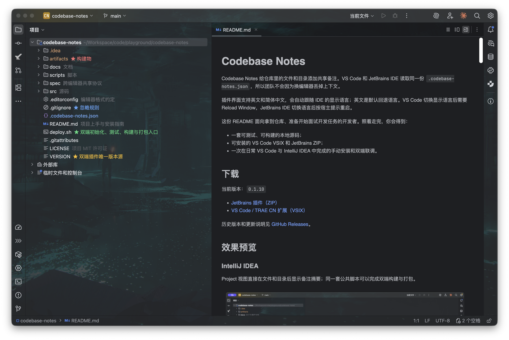
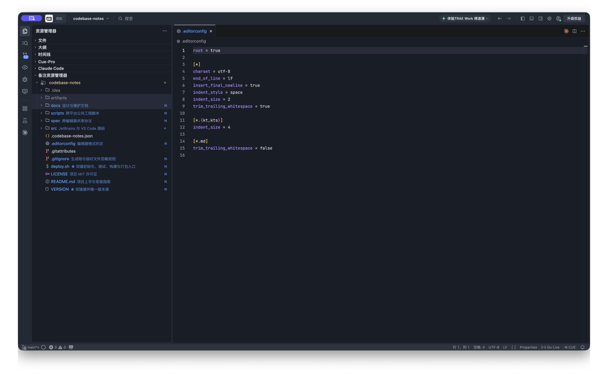

# 代码备注

在 VS Code、TRAE 和 JetBrains IDE 中，为仓库文件与目录添加可共享、可版本控制的代码备注。

- 两端读取同一份 `.codebase-notes.json`
- 支持文件、目录、搜索、路径迁移和五种语义样式
- 备注可以随 Git 提交，团队切换编辑器也不会丢失上下文
- 界面支持英文和简体中文

## 官方链接

- [GitHub 开源仓库](https://github.com/joeljhou/codebase-notes)
- [VS Code Marketplace 插件](https://marketplace.visualstudio.com/items?itemName=joeljhou.codebase-notes-vscode)
- [JetBrains Marketplace 插件（审核中）](https://plugins.jetbrains.com/plugin/32981-codebase-notes)

## 下载与安装

当前版本：`0.1.23`

- [JetBrains 插件（ZIP）](https://github.com/joeljhou/codebase-notes/releases/download/v0.1.23/codebase-notes-jetbrains-0.1.23.zip)
- [VS Code / TRAE 扩展（VSIX）](https://github.com/joeljhou/codebase-notes/releases/download/v0.1.23/codebase-notes-vscode-0.1.23.vsix)
- [历史版本与更新说明](https://github.com/joeljhou/codebase-notes/releases)

VS Code / TRAE：在扩展视图右上角菜单中选择 `Install from VSIX...`。

JetBrains IDE：打开 `Settings / Preferences` → `Plugins`，从齿轮菜单选择 `Install Plugin from Disk...`，直接选择 ZIP，无需解压。

运行要求：VS Code `1.107.0+`，IntelliJ IDEA `2025.3+`（build `253+`）。

## 效果预览

### IntelliJ IDEA

Project 视图直接在文件和目录后显示备注。



### VS Code / TRAE

“代码备注”视图保留原生资源树交互，并单独渲染备注颜色；系统资源管理器的文件颜色不会被修改。



## 使用

在项目树中右键文件或目录，打开“代码备注”菜单即可：

- 编辑或清除文字备注
- 设置备注样式
- 在系统资源管理器与“代码备注”之间切换定位
- 搜索备注或重新关联已移动的路径

选中文件或目录后，也可以用快捷键直接操作：

- VS Code / TRAE：`Option+R` / `Alt+R` 编辑备注，`Shift+Option+R` / `Shift+Alt+R` 设置样式。
- JetBrains：`Option+R` / `Alt+R` 编辑备注，`Shift+Option+R` / `Shift+Alt+R` 设置样式；如与 IDE 原生操作冲突，可在 Keymap 中删除或修改其中一个快捷键。

第一次保存备注时，插件会在项目根目录创建 `.codebase-notes.json`：

```json
{
  "version": 1,
  "notes": {
    "src/App.ts": {
      "text": "应用入口，只负责装配",
      "style": "info"
    },
    "scripts": {
      "text": "构建与维护脚本",
      "style": "warning"
    }
  }
}
```

| `style` | 用途 |
| --- | --- |
| `default` | 普通说明；保存时省略 `style` |
| `info` | 值得关注的信息 |
| `success` | 已确认、稳定或已完成 |
| `warning` | 风险或待处理事项 |
| `danger` | 高风险、禁止修改或严重问题 |

旧配置中的 `muted` 仍可读取，但新菜单不再提供该选项。`text` 长度为 1～2000 个字符。

`.codebase-notes.json` 是唯一事实来源，建议提交到 Git。以下运行时文件应保持忽略：

```gitignore
.codebase-notes.json.lock
.codebase-notes.json.tmp.*
```

## 二次开发

### 环境

| 工具 | 版本 |
| --- | --- |
| Node.js | 22 |
| npm | 随 Node.js 安装 |
| JDK | 21 |
| Git | 近期版本 |

### 初始化

```bash
git clone https://github.com/joeljhou/codebase-notes.git
cd codebase-notes
./deploy.sh init
./deploy.sh test
```

首次构建 JetBrains 插件会下载 Gradle、IntelliJ Platform SDK 和 Maven 依赖，耗时会明显更长。

### 统一工程脚本

直接执行 `./deploy.sh` 可以使用方向键菜单；自动化场景使用英文命令：

| 命令 | 作用 |
| --- | --- |
| `./deploy.sh init [all\|vscode\|jetbrains]` | 初始化依赖与工程 |
| `./deploy.sh test [all\|vscode\|jetbrains]` | 运行共享协议和平台测试 |
| `./deploy.sh build [all\|vscode\|jetbrains]` | 构建插件 |
| `./deploy.sh package [all\|vscode\|jetbrains]` | 将安装包汇总到 `artifacts/` |
| `./deploy.sh clean [all\|vscode\|jetbrains]` | 清理生成物 |
| `./deploy.sh version [新版本]` | 查看或更新全局版本 |

根目录 `VERSION` 是双端唯一版本源。不要分别修改 VS Code 与 JetBrains 的插件版本。

### 单端开发

VS Code：

```bash
cd src/vscode
npm run typecheck
npm test
npm run test:integration
npm run compile
```

编译后可以用命令行启动 Extension Development Host：

```bash
code --new-window --extensionDevelopmentPath="$PWD" /absolute/path/to/test-project
```

TypeScript 修改后需要重新执行 `npm run compile`，再在测试窗口运行 `Developer: Reload Window`。

JetBrains：

```bash
cd src/jetbrains
./gradlew test
./gradlew runIde
./gradlew buildPlugin
```

开发 Kotlin 时可以直接用 IntelliJ IDEA 打开 `src/jetbrains`，并将 Gradle JVM 设置为 JDK 21。

### 目录结构

```text
VERSION             双端唯一版本源
deploy.sh           初始化、测试、构建和打包入口
spec/               JSON Schema 与跨语言一致性用例
src/vscode/         TypeScript + VS Code 扩展
src/jetbrains/      Kotlin + JetBrains 插件
scripts/            跨平台公共工程脚本
docs/platform/      协议、实现、测试计划与设计评审
```

两个插件不共享运行时二进制，而是共享 Schema 与 `spec/conformance` 测试用例。修改跨编辑器行为时，推荐按以下顺序进行：

1. 更新 Schema、协议或一致性 fixture。
2. 分别实现 VS Code 与 JetBrains 行为。
3. 运行 `./deploy.sh test`。
4. UI 或宿主集成有变化时，再运行对应的集成测试。
5. 使用 `./deploy.sh version` 更新版本并重新打包。

## 常见问题

**源码修改后没有生效**：VS Code 重新执行 `npm run compile` 并 Reload Window；JetBrains 停止后重新执行 `./gradlew runIde`。

**插件已安装但没有配置文件**：只有第一次保存备注时才会创建 `.codebase-notes.json`。

**看不到完整备注文字**：VS Code 的完整备注显示在“代码备注”视图；系统资源管理器保持原生显示。

## 进一步阅读

- [文档索引与维护规则](docs/README.md)
- [v1 协议规范](docs/platform/specs/S20260717_platform_codebase_notes_protocol.md)
- [实现方案](docs/platform/specs/S20260717_platform_codebase_notes_implementation.md)
- [双端集成测试计划](docs/platform/specs/S20260717_platform_codebase_notes_integration_test_plan.md)
- [设计评审结论](docs/platform/reports/R20260717_platform_codebase_notes_design_review.md)
- [JSON Schema](spec/codebase-notes.schema.json)

项目采用 [MIT License](LICENSE)。产品思路参考 [Link-Kou/intellij-treeInfotip](https://github.com/Link-Kou/intellij-treeInfotip)，跨编辑器协议、并发写入、路径事件与 UI 适配为独立实现。
