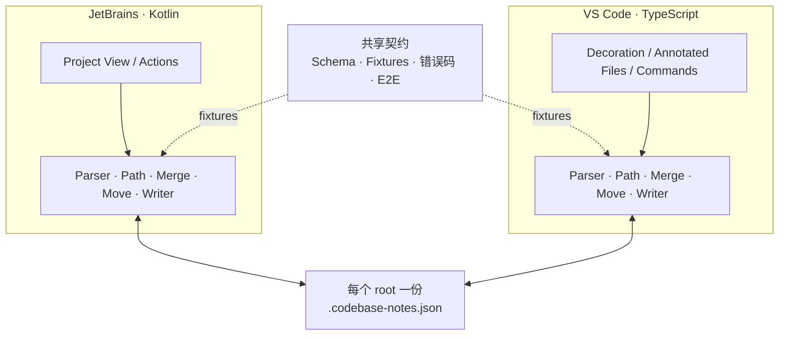
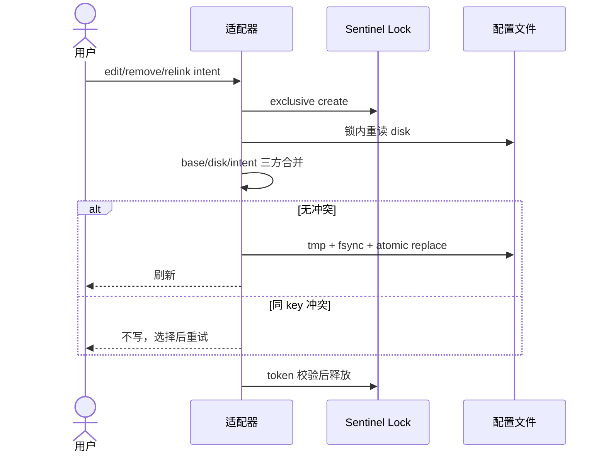

# Codebase Notes v1 方案设计与评审结论

> 状态：已采纳并进入实现
> 最后更新：2026-07-17
> 适用范围：本地文件系统、JetBrains Desktop、VS Code Desktop
> 关联文档：[协议规范](../specs/S20260717_platform_codebase_notes_protocol.md)、[实现方案](../specs/S20260717_platform_codebase_notes_implementation.md)、[集成测试方案](../specs/S20260717_platform_codebase_notes_integration_test_plan.md)

## 1. 结论

v1 只验证一个闭环：**同一 workspace/project root 下的一份 JSON 备注，能被 JetBrains 与 VS Code 安全地读取、编辑、展示，并跟随常见路径变化。**

保留数据安全底座：invalid/future version 只读、锁内重读、同 key 冲突检测、临时文件 + 原子替换、未知字段保留、路径校验。

删除或后移不能直接证明核心价值的复杂度：嵌套配置、跨配置事务、TreeInfotip 导入、tags、lossless number token、自定义 Git merge driver 和外部移动自动猜测。

## 2. 收敛后的架构



一份数据、两个原生适配器、一个可执行契约。没有后台服务，没有跨语言 runtime，没有仓库递归配置发现。

## 3. 评审项处理

| 建议 | 结论 | 理由与落地 |
| --- | --- | --- |
| 双端独立实现成本高 | 部分采纳 | v1 仍用原生 Kotlin/TypeScript，避免 Wasm/ABI/打包复杂度；改为先 TS 竖切再 Kotlin，并设置“一个周期 2 次分歧、第三适配器、纯核心持续膨胀”的重评触发条件 |
| 不应自研严格 + 无损 JSON | 采纳 | 使用成熟 parser + Schema；重复 key 通过库能力/轻量校验拒绝；取消 number token 保真，超出 safe integer 直接拒绝并建议字符串 |
| TreeInfotip 不该进 v1 | 采纳 | 从协议、命令、fixture、E2E 和发布门槛移除；以后做独立一次性迁移工具或 v1.1 |
| 缺少 Git merge 设计 | 采纳 | 明确不同 key 可能自动合并、同 key 人工解决；增加 Git 专项测试；不采用文本 `union` driver |
| 外部目录移动只能逐条 Relink | 采纳 | 增加确定性的 `Relink Prefix`：旧前缀到新目录、预览、全有或全无；仍不做相似度猜测 |
| 大小写不敏感文件系统容易 alias | 采纳 | 新建/迁移 key 前逐段读取实际目录项大小写；已有歧义仍报 alias，禁止静默合并 |
| tags 没有消费方 | 采纳 | 从 v1 公共 Schema 和 UI 移除；搜索域固定为 path + text |
| lock 文件可能被提交 | 部分采纳 | 保留 sentinel lock，因为 JVM/Node 缺少简单统一的 OS lock；仓库提供 ignore 规则。tracked-lock 检测不影响主闭环，暂缓实现 |

### 3.1 额外优化：移除嵌套配置

原方案的嵌套配置会连带产生：

```text
递归扫描
→ 最近祖先所有权
→ shadowed 状态
→ 跨根双锁事务
→ 半完成 recovery
→ 更大的路径与 E2E 矩阵
```

这些都不是验证“双编辑器共享备注”的必要条件。v1 每个 boundary root 只有一份配置；VS Code multi-root 各 root 独立。跨 root 移动暂不自动迁移。

## 4. 数据模型

```json
{
  "version": 1,
  "notes": {
    "src/App.ts": {
      "text": "应用入口，只做装配",
      "style": "info"
    }
  }
}
```

- `text` 是唯一必要业务字段。
- `style` 已有明确展示消费方，保留。
- `tags` 没有 v1 消费方，移除。
- 未知字段按 JSON 语义值保留，用于小版本前向扩展；number 统一按 IEEE-754 binary64 解释。
- 大整数、精确十进制数或要求字面量不变的扩展值使用字符串。

## 5. 核心正确性

### 5.1 读取

1. 只检查 boundary root 的固定配置。
2. 用标准 parser 解析，执行重复 key、safe number、Schema 和路径规则。
3. 生成不可变快照；UI 不在渲染线程读磁盘。
4. invalid 和 future version 只读，不自动修复。

### 5.2 写入



锁串行化提交，三方合并保护用户意图，原子替换保护文件本身。三者解决的是不同问题，不能互相替代。

### 5.3 路径变化

- IDE 内同 root rename/move：一次规划，一次提交，冲突全回滚。
- 外部 move：保留 missing，不自动猜。
- 外部目录 move：用户用 Relink Prefix 做确定性批量恢复。
- 跨 root：v1 由用户在目标新增、确认后删除源。

## 6. Git 协作

单 JSON 文件是 v1 的最小存储单元，优点是易理解、易提交、易备份；代价是团队并行修改可能冲突。

- 稳定 key 排序降低 diff 噪声。
- 不同 note 的 add/add 大多可合并，但不作保证。
- 同一 note 的并发编辑必须人工处理。
- Git 冲突标记会让配置非法，插件只读，绝不“修复”后覆盖。
- 不使用 `union` merge driver，因为它不理解 JSON object，可能把冲突伪装成成功。

若真实使用表明单文件冲突频率不可接受，再以数据评估 object-aware driver 或分片存储；v1 不预付这笔复杂度。

## 7. 实施路线

1. 可构建空壳与最小 Schema/fixtures。
2. VS Code 端完成一条 edit → atomic write → decoration 竖切。
3. JetBrains 端消费同一配置和 fixtures。
4. 补锁、三方合并、故障注入。
5. 补 rename、实际大小写、missing 和 Relink Prefix。
6. 用 ZIP/VSIX 完成双端 E2E，再扩大兼容矩阵。

这个顺序让 UI、协议和平台限制尽早暴露，同时避免把未验证的抽象复制两遍。

## 8. v1 不做

- 嵌套 `.codebase-notes.json`。
- 跨 boundary root 原子迁移。
- TreeInfotip 导入。
- tags 与 tag filter。
- lossless number token 和自研 JSON AST。
- VS Code Remote、Virtual Workspace、Web Extension。
- 外部移动自动推断。
- 自定义 Git merge driver。
- 实时协同编辑。
- 数据库、daemon、Wasm 或 native module。

## 9. 后续触发条件

只有出现证据才扩展：

| 证据 | 候选动作 |
| --- | --- |
| monorepo 用户确实需要分区所有权 | 设计嵌套配置，先定义 ownership 和跨根失败模型 |
| TreeInfotip 迁移需求真实存在 | 独立 CLI/一次性脚本，不耦合插件核心 |
| tag 搜索成为高频需求 | 小版本加入 tags schema、编辑与过滤 |
| 双端反复发生逻辑漂移 | 评估生成代码、KMP/JS 或共享 runtime |
| Git 冲突数据明显偏高 | 评估 object-aware merge driver 或分片格式 |

没有触发证据，就保持 v1 小而可验证。
